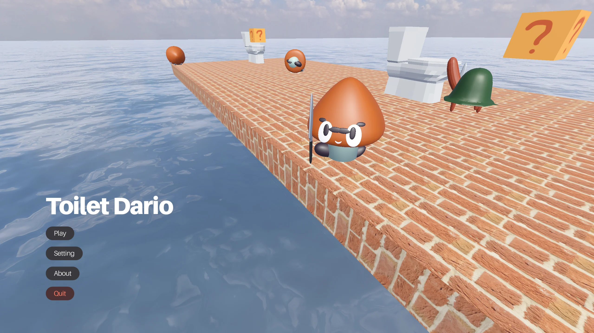
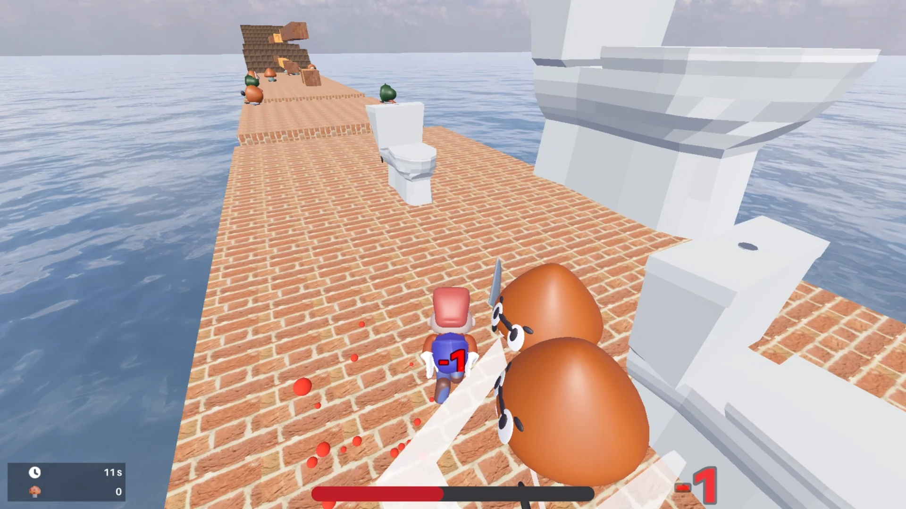
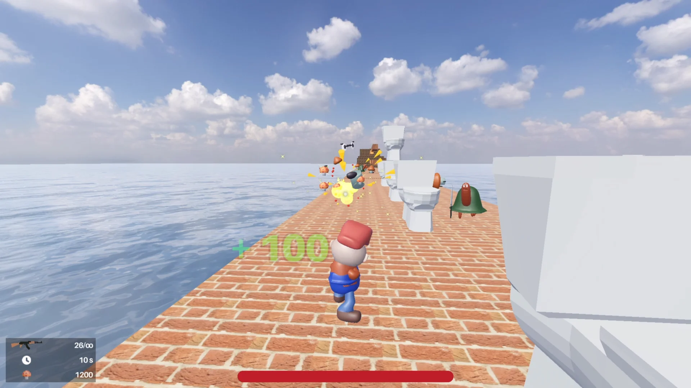
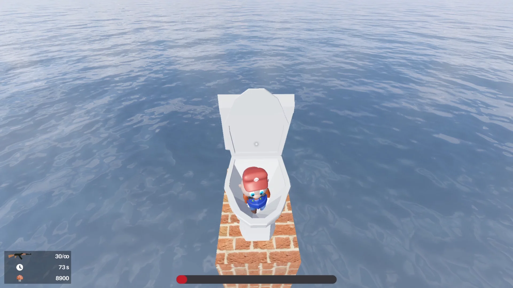
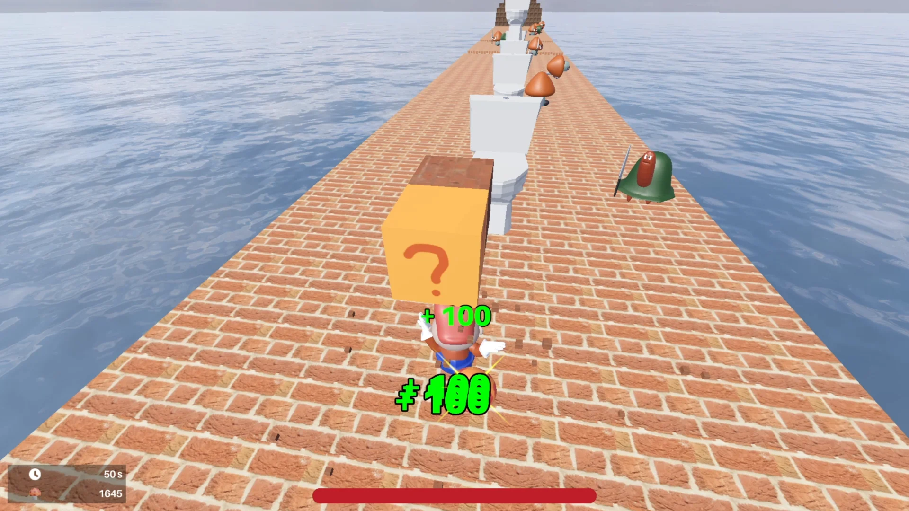
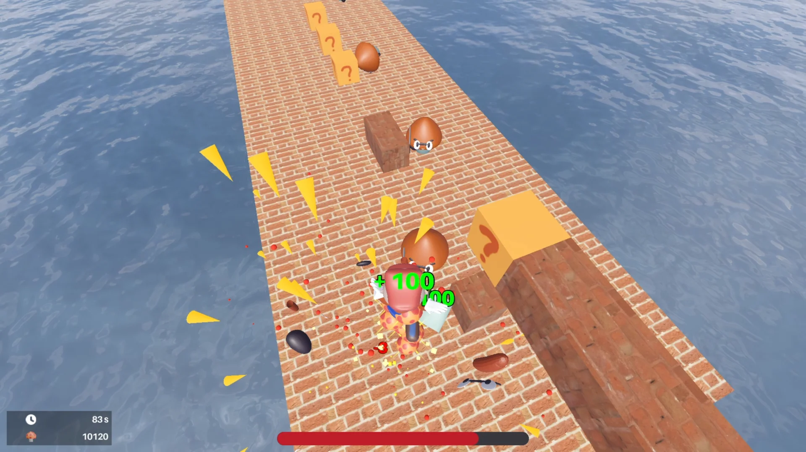

# [→ Download here ←](https://voidcordtech.itch.io/toilet-dario)

## About
Toilet Dario is a 3D platformer, shooter game. This game have nothing related to Super Mario Bros at all (for the legal reason), lol.

This game is incomplete and buggy, i know. But i am lazy.

## License
> You are free to use, modify, and distribute this project for any purpose, including commercial use, no credit required.
- Project: Toilet Dario is licensed under the [MIT-0 License](LICENSE).
- Assets: All the assets in the `Assets` folder are licensed under the [CC0 License](https://creativecommons.org/publicdomain/zero/1.0/).
- Addons: All the addons in the `addons` folder are either licensed under MIT License or CC0 License. See their own `LICENSE` files in the addon folders for more information.

## Follow Voidcord
- [Youtube Devlog](https://youtu.be/lyctDyaqTMI)
- [Youtube Channel](https://www.youtube.com/@voidcordtech)

## Gallery

